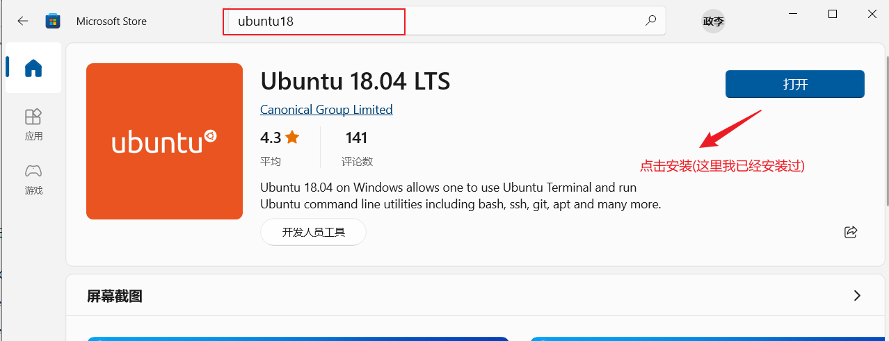
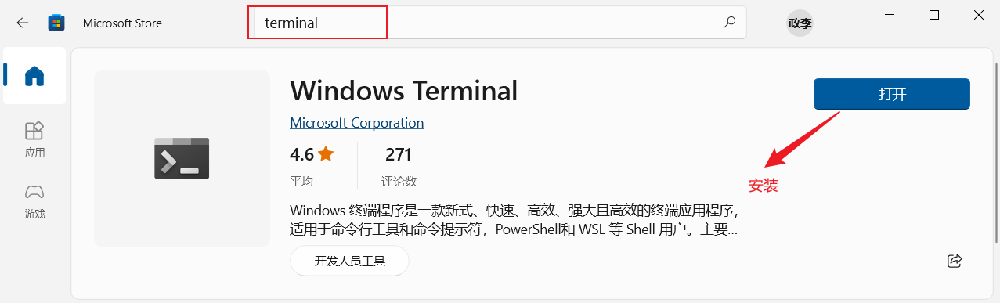
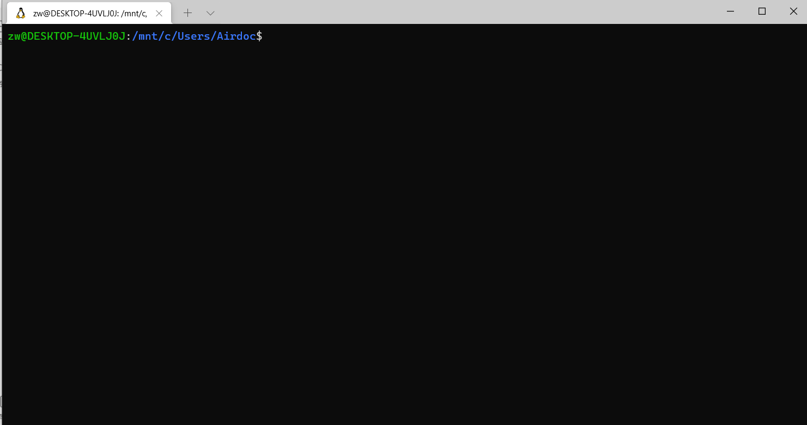
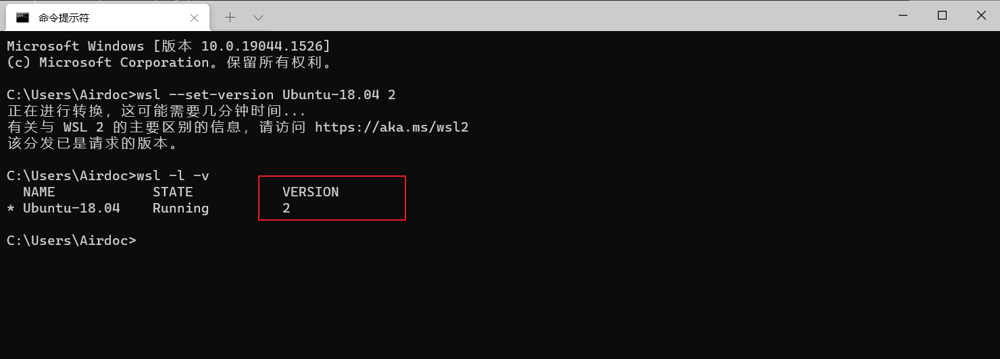
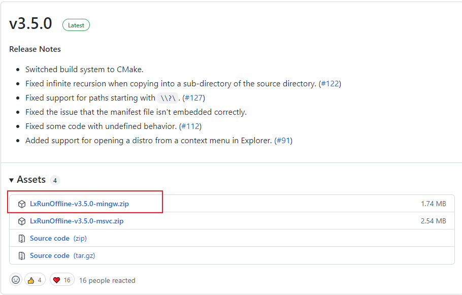

WSL安装
========================================

1 安装wsl Ubuntu18.04
^^^^^^^^^^^^^^^^^^^^^^^^^^^^^^^^^^^^^^^^

2 安装terminal
^^^^^^^^^^^^^^^^^^^^^^^^^^^^^^^^^^^^^^^^

安装好terminal后, 运行terminal会进入到wsl安装页面, 安装后最终效果如下

3 wsl1升级wsl2
^^^^^^^^^^^^^^^^^^^^^^^^^^^^^^^^^^^^^^^^

wsl2比wsl1的内核更完整，因此推荐更新到wsl2，升级wsl2需要先升级win10的wsl2支持包，下载安装后需要重启系统。

- win10支持wsl2链接：https://wslstorestorage.blob.core.windows.net/wslblob/wsl_update_x64.msi
- 在power shell 输入如下命令升级wsl1为wsl2
::

    wsl --set-version Ubuntu-18.04 2

4 wsl2迁移
^^^^^^^^^^^^^^^^^^^^^^^^^^^^^^^^^^^^^^^^

wsl默认安装在C盘, 为了避免C盘爆盘，因此需要将wsl安装到其他盘符下，这里以E盘为例

- 安装迁移工具：https://github.com/DDoSolitary/LxRunOffline/releases

- 解压后在该工具所在目录执行如下命令
::

    # 迁移到目标地址：-n指定WSL，-d指定目标地址
    .\LxRunOffline.exe move -n Ubuntu-18.04 -d E:\wsl

    # 查看迁移后的地址，观察是否迁移成功
    .\LxRunOffline.exe get-dir -n Ubuntu-18.04

